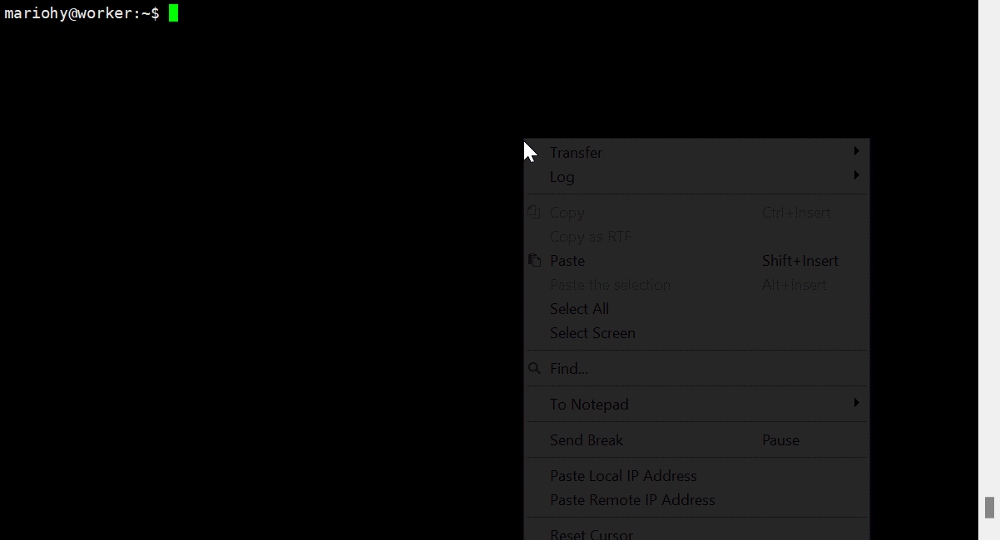

# CVE-2026-31431 Audit


This project provides a professional Python script designed to check if a system is vulnerable to **CVE-2026-31431** and demonstrates how to exploit it for research purposes.

## 🎬 Full Workflow

The diagram below illustrates the complete workflow from Environment Audit (SCAN), Patch Injection (PUNCH), to Root Privilege Escalation (SHELL), and finally Trace Cleanup (CLEAN):



---

## 🛠 Core Features

*   **Detection**: Checks if the current kernel is affected by the CVE-2026-31431 vulnerability using a non-destructive shadow sequence.
*   **Exploitation**: Leverages the vulnerability via page cache hijacking to inject data into `/etc/passwd` for privilege escalation simulation.
*   **Verification**: Invokes an interactive environment to verify the elevated privileges and gain root access.
*   **Cleanup**: Flushes the system page cache to restore the audit state and ensure system consistency.

## 🚀 Usagee

```bash
curl -fsSL https://raw.githubusercontent.com/MarioHY/cve_2026_31431_audit/main/exploit.py -o exploit.py && chmod +x exploit.py && ./exploit.py

```
